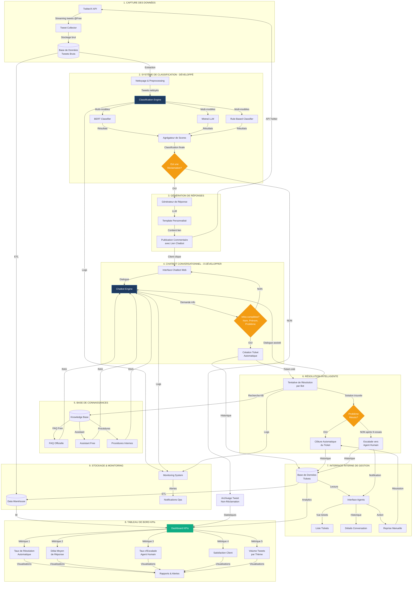
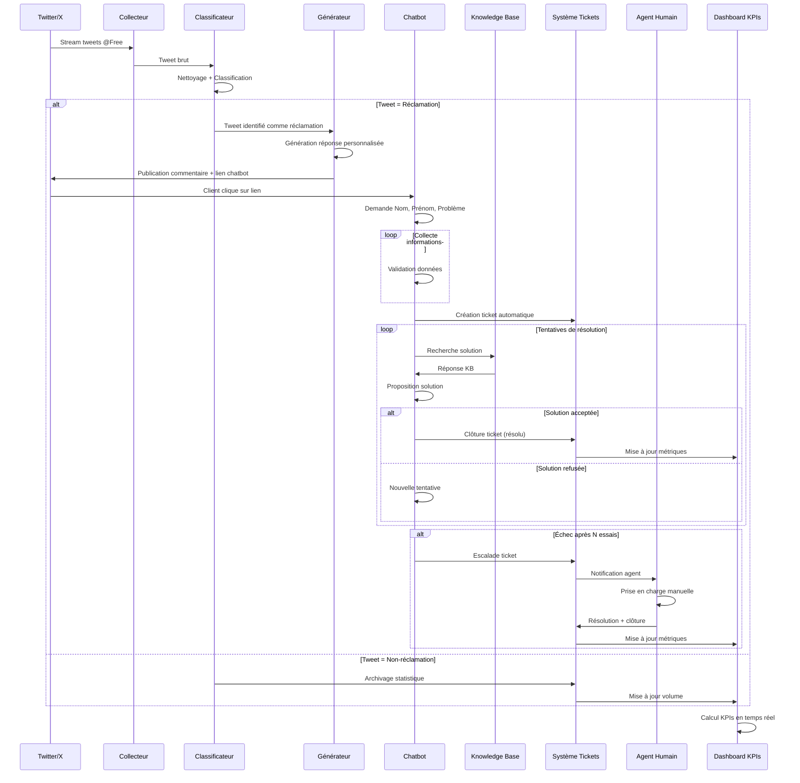
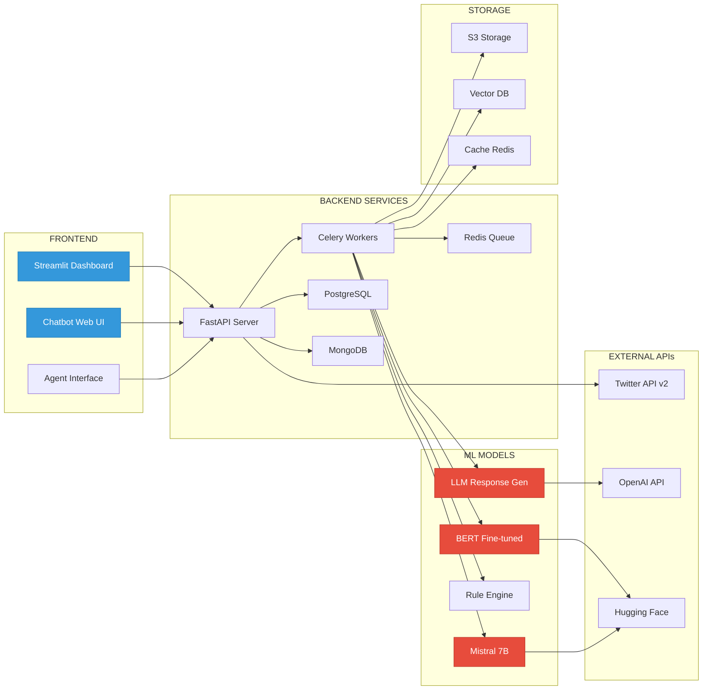
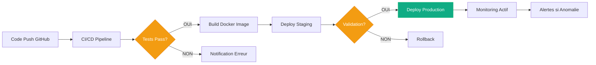

# FreeMobilaChat - Architecture Complète

## Diagramme d'Architecture du Système

## Flux de Données Détaillé

## Architecture Technique par Composant

## Légende des Composants

### 🟦 Développé (Production Ready)
- **Système de Classification**: BERT + Mistral + Rules
- **Dashboard Streamlit**: Interface d'analyse et visualisation
- **Preprocessing Pipeline**: Nettoyage et normalisation des tweets
- **KPI Analytics**: Calcul et affichage des métriques

### 🟨 En Développement
- **Tweet Collector**: Capture automatique via Twitter API
- **Response Generator**: Génération de réponses personnalisées

### 🟥 À Développer
- **Chatbot Conversationnel**: Interface de dialogue client
- **Knowledge Base Integration**: Connexion FAQ/Assistant Free
- **Ticket Management System**: Création et suivi des tickets
- **Agent Interface**: Interface pour agents humains
- **Escalation Logic**: Logique de transfert automatique

## Métriques KPIs Principales

| KPI | Description | Objectif |
|-----|-------------|----------|
| **Taux de Classification** | % tweets correctement classifiés | > 90% |
| **Précision Réclamations** | Precision sur détection réclamations | > 85% |
| **Taux Résolution Auto** | % tickets résolus par bot | > 60% |
| **Délai Moyen Réponse** | Temps moyen première réponse | < 5 min |
| **Taux Escalade** | % tickets transmis agents | < 30% |
| **Satisfaction Client** | Score satisfaction post-résolution | > 4/5 |
| **Temps Résolution** | Durée moyenne clôture ticket | < 2h |

## Technologies Utilisées

### Classification (Actuel)
- **ML Frameworks**: PyTorch, Transformers, Scikit-learn
- **Models**: BERT (CamemBERT), Mistral 7B
- **Frontend**: Streamlit 1.28.1
- **Viz**: Plotly, Pandas
- **Storage**: CSV, JSON (academic version)

### Production (Futur)
- **Backend**: FastAPI, Celery
- **Database**: PostgreSQL (tickets), MongoDB (tweets)
- **Cache**: Redis
- **ML Serving**: Hugging Face Inference API
- **Deployment**: Docker, Kubernetes
- **Monitoring**: Prometheus, Grafana
- **APIs**: Twitter API v2, OpenAI API

## Workflow de Déploiement

## Évolutivité et Performance

### Scalabilité Horizontale
- **Tweet Collector**: Multi-threading pour capture en temps réel
- **Classification**: Batch processing parallèle
- **Chatbot**: Load balancing sur plusieurs instances
- **Database**: Sharding pour haute volumétrie

### Optimisations
- **Cache Redis**: Réponses fréquentes pré-calculées
- **Vector Database**: Recherche sémantique rapide dans KB
- **Model Serving**: Quantization + ONNX Runtime
- **CDN**: Assets statiques chatbot

---

**Version**: 1.0  
**Date**: 2024-01-10  
**Auteur**: FreeMobilaChat Team  
**Statut**: Architecture de Référence
